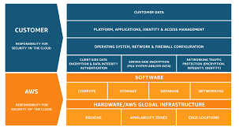

# CLOUD FORMATION2

## 1) Explain the AWS Shared responsibility model?
       he AWS Shared Responsibility Model is a security framework that outlines the security responsibilities of AWS and its customers. The model describes how security responsibilities are shared between AWS and the customer, and helps to ensure that both parties understand their respective security roles.

      In the AWS Shared Responsibility Model, AWS is responsible for the security of the cloud, which includes the physical security of data centers, the security of the underlying infrastructure, and the security of AWS services. This includes tasks such as patching and updating the infrastructure, protecting the physical data centers, and securing the AWS platform.

      Customers are responsible for the security of their data in the cloud, as well as the security of their applications and services. This includes tasks such as configuring their own security groups, managing access control to their resources, implementing encryption for their data, and ensuring the security of their applications.

      The level of customer responsibility depends on the type of service used. For example, for Infrastructure as a Service (IaaS) offerings like Amazon EC2, customers are responsible for securing their own operating systems, applications, and data, while for Platform as a Service (PaaS) offerings like AWS Elastic Beanstalk, AWS manages the operating system and customers are responsible for securing their applications and data.

     The AWS Shared Responsibility Model helps to ensure that security is a shared responsibility between AWS and its customers, and that both parties are aware of their respective security responsibilities. This enables customers to take an active role in securing their own data and applications in the cloud, while also allowing AWS to focus on providing secure and reliable cloud services.
        

       
         
## 2) Explain an Identity and Access Management (IAM) Role?
         An Identity and Access Management (IAM) role is a set of permissions that define a specific set of actions that can be performed by an entity, such as a user
         or application, within a system or service. IAM roles are used to grant permissions to perform certain tasks without the need for long-term access credentials, such as a username and password. Instead, roles are assigned to entities through an IAM policy that defines the permissions associated with the role.

       IAM roles provide a more secure way to manage access to resources by allowing permissions to be granted based on specific needs rather than granting broad access. They are often used in cloud computing environments to manage access to services and resources across multiple accounts or applications. In summary, an IAM role is a collection of permissions that can be assigned to an entity through an IAM policy, allowing for more secure and fine-grained access control to resources within a system or service.
## 3) Explain an Identity and Access Management (IAM) Policy?
       
        An IAM policy is a document that defines permissions and access control for entities, such as users or applications, within a system or service. It outlines the actions that are allowed or denied based on various conditions and can be used to manage access to resources and services within an organization. IAM policies are often used in conjunction with IAM roles to provide secure and granular access control to resources.

## 4) Describe an Amazon Machine Image (AMI)?
      
       An Amazon Machine Image (AMI) is a pre-configured virtual machine image that can be used to create an instance on the Amazon Web Services (AWS) cloud platform. An AMI includes the operating system, application server, and any additional software needed to run an application. It also includes any custom configurations and data specific to the user's needs.

## 5) List the different EC2 instance types with use cases for each type?
        General Purpose: These instances are a good fit for most workloads that require a balance of compute, memory, and network resources. They are ideal for running small to medium-sized databases, web servers, and development environments. Examples include the t2, m5, and m6g instance families.
        
        Compute Optimized: These instances are designed for workloads that require high compute power, such as high-performance computing (HPC), batch processing, and scientific computing. They offer a higher ratio of compute resources to memory and network resources. Examples include the c5 and c6g instance families.
        
        Memory Optimized: These instances are designed for workloads that require large amounts of memory, such as in-memory databases, real-time big data processing, and caching. They offer a higher ratio of memory resources to compute and network resources. Examples include the r5 and r6g instance families.
        
        
        Storage Optimized: These instances are designed for workloads that require high storage capacity, such as data warehousing, log processing, and large-scale file systems. They offer a higher ratio of storage resources to compute and memory resources. Examples include the i3 and d3 instance families.
        
        GPU Optimized: These instances are designed for workloads that require high-performance graphics processing, such as video rendering, machine learning, and gaming. They come with one or more graphics processing units (GPUs) and offer a higher ratio of GPU resources to compute and memory resources. Examples include the p3 and g4 instance families.
        
        FPGA Optimized: These instances are designed for workloads that require high-performance hardware acceleration, such as genomics, financial analysis, and data compression. They come with one or more field-programmable gate arrays (FPGAs) and offer a higher ratio of FPGA resources to compute and memory resources. Examples include the f1 instance family.
## 6) Explain Virtual Private Cloud (VPC)?
    A Virtual Private Cloud (VPC) is a virtual network infrastructure that allows users to create isolated and secure network environments within the Amazon Web Services (AWS) cloud platform. It provides complete control over the virtual networking environment, including IP address ranges, subnets, and routing tables.
       
## 7) Differentiate between a Public and a Private subnet?
     A subnet is a logical subdivision of an IP network that enables network administrators to segment a larger network into smaller, more manageable subnetworks. When creating subnets, network administrators can choose between public and private subnets.

     The main difference between a public and a private subnet is how they are accessed from the internet.
     
     A public subnet is a subnet that is accessible from the internet. It has a publicly routable IP address that can be reached from anywhere on the internet. Public subnets are typically used for resources that need to be accessed from the internet, such as web servers, mail servers, or other public-facing services.
      
     a private subnet is a subnet that is not accessible from the internet. It uses private IP addresses that are not routable on the public internet. Private subnets are typically used for resources that do not need to be accessed from the internet, such as internal database servers, application servers, or other internal resources.

     To access a resource in a private subnet from the internet, you need to use a mechanism such as VPN or a bastion host that provides a secure and controlled entry point into the private subnet.